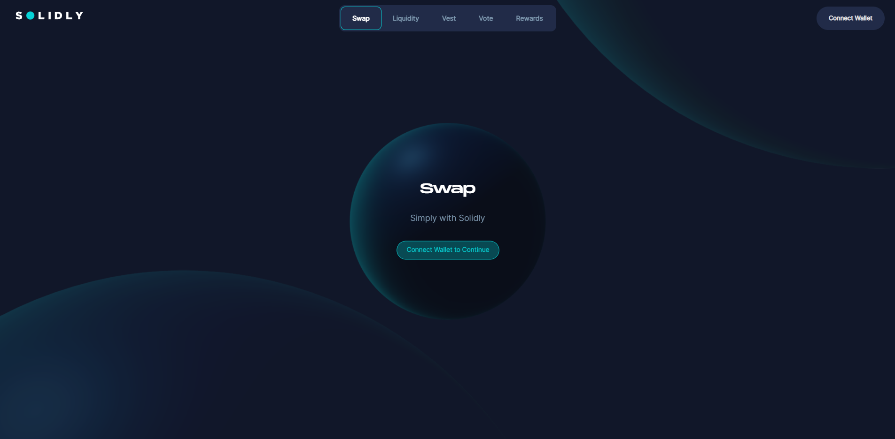

# Solidly - ve(3,3) on Meter Testnet

## What is Solidly
Solidly allows low cost, near 0 slippage trades on uncorrelated or tightly correlated assets. The protocol incentivizes fees instead of liquidity. Liquidity providers (LPs) are given incentives in the form of token, the amount received is calculated as follows;

100% of weekly distribution weighted on votes from ve-token holders
The above is distributed to the gauge (see below), however LPs will earn between 40% and 100% based on their own ve-token balance.

LPs with 0 ve* balance, will earn a maximum of 40%.

# AMM

What differentiates Solidly's AMM;

Solidly AMMs are compatible with all the standard features as popularized by Uniswap V2, these include;

Lazy LP management
Fungible LP positions
Chained swaps to route between pairs
priceCumulativeLast that can be used as external TWAP
Flashloan proof TWAP
Direct LP rewards via skim
xy>=k
Solidly adds on the following features;

0 upkeep 30 minute TWAPs. This means no additional upkeep is required, you can quote directly from the pair
Fee split. Fees do not auto accrue, this allows external protocols to be able to profit from the fee claim
New curve: x3y+y3x, which allows efficient stable swaps
Curve quoting: y = (sqrt((27 a^3 b x^2 + 27 a b^3 x^2)^2 + 108 x^12) + 27 a^3 b x^2 + 27 a b^3 x^2)^(1/3)/(3 2^(1/3) x) - (2^(1/3) x^3)/(sqrt((27 a^3 b x^2 + 27 a b^3 x^2)^2 + 108 x^12) + 27 a^3 b x^2 + 27 a b^3 x^2)^(1/3)

Routing through both stable and volatile pairs

Flashloan proof reserve quoting

# Terminology
token ~ transferable, used for incentives via emission

ve ~ non-transferable, locked up by depositing base token into the voting escrow contract, period from 1 week to 4 years

ve lockers vote which permissionless pools should be incentivized

ve lockers accumulate all protocol fees

total_supply = token.total_supply

locked_supply = ve.total_supply

circulating_supply = total_supply - locked_supply

# Conclusion

If all participants lock, emission decreases to 0, if only 50% of participants lock, emission is 50%, however lockers increase proportionally to emission.

Thus; ve(3,3)

## Getting started
- Make sure to have nodejs installed. This app is built using [Next.js](https://nextjs.org/learn/basics/create-nextjs-app) and [react](https://reactjs.org/docs/getting-started.html).
- Run `npm install`
- You can now run the nextjs app this way: `npm run dev`
- That's it! You can now start hacking and submit PRs.
